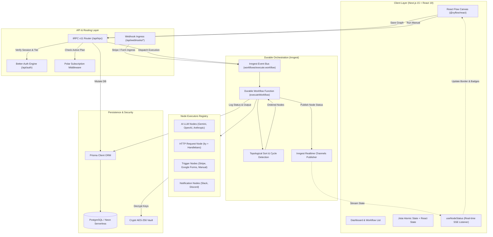
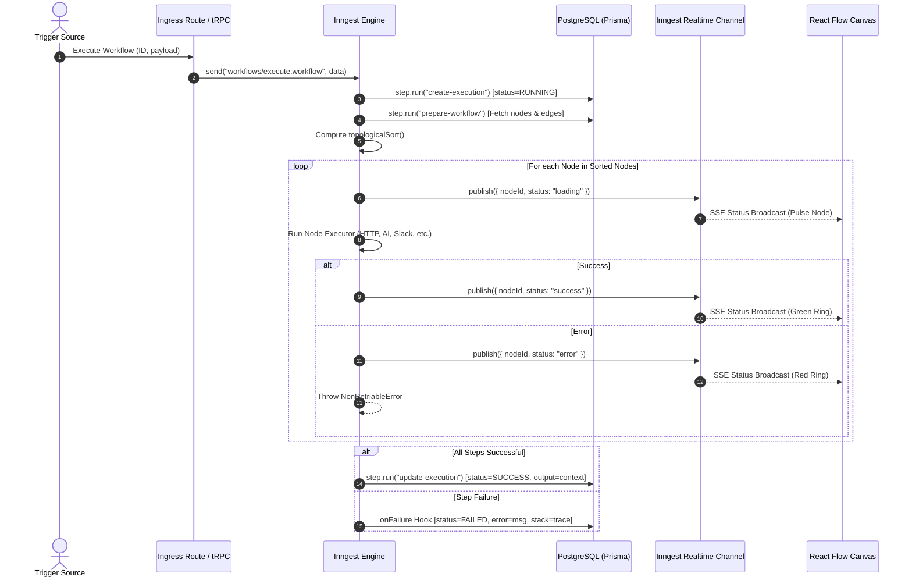

# Orchify Architecture & System Design

This document outlines the technical architecture, execution semantics, data models, and real-time streaming infrastructure powering **Orchify**.

---

## 1. System Overview

Orchify is a cloud-native, event-driven workflow automation engine designed to build, execute, and monitor Directed Acyclic Graphs (DAGs) of computational nodes. The system combines the visual authoring ergonomics of **React Flow** with the resilience and observability of **Inngest's durable execution engine**.

### Architectural Tenets
1. **End-to-End Type Safety**: Built with TypeScript across all layers—from Prisma ORM schemas, tRPC v11 API procedures, to React Flow node state and Inngest channel events.
2. **Durable, Fault-Tolerant Execution**: Every step of a workflow runs inside an isolated, retryable Inngest step. System crashes, network timeouts, or rate limits automatically pause and resume without losing workflow state.
3. **Linearized DAG Processing**: Workflows authored visually as graphs are resolved through topological sorting with automated cycle detection before execution.
4. **Real-Time Canvas Telemetry**: Node execution lifecycle states (`loading`, `success`, `error`) stream directly to the browser via Server-Sent Events (SSE) / WebSockets using `@inngest/realtime`, giving instant visual feedback on the canvas.
5. **Zero-Trust Credential Vault**: Third-party API keys (OpenAI, Anthropic, Gemini) are symmetrically encrypted with AES-256-GCM at rest and decrypted solely in ephemeral worker steps.

---

## 2. High-Level Architectural Topology



---

## 3. The DAG Data Model

Workflows are modeled simultaneously as a graph on the client and as normalized relational tables in PostgreSQL:

### Relational Schema Representation
```prisma
model Workflow {
  id          String       @id @default(cuid())
  name        String
  userId      String
  user        User         @relation(fields: [userId], references: [id], onDelete: Cascade)
  nodes       Node[]
  connections Connection[]
  executions  Execution[]
  createdAt   DateTime     @default(now())
  updatedAt   DateTime     @updatedAt
}

model Node {
  id                String       @id @default(cuid())
  workflowId        String
  workflow          Workflow     @relation(fields: [workflowId], references: [id], onDelete: Cascade)
  name              String
  type              NodeType     // INITIAL, MANUAL_TRIGGER, HTTP_REQUEST, GEMINI, etc.
  position          Json         // { x: number, y: number }
  data              Json         @default("{}")
  credentialId      String?
  credential        Credential?  @relation(fields: [credentialId], references: [id])
  outputConnections Connection[] @relation("FromNode")
  inputConnections  Connection[] @relation("ToNode")
}

model Connection {
  id           String   @id @default(cuid())
  workflowId   String
  workflow     Workflow @relation(fields: [workflowId], references: [id], onDelete: Cascade)
  fromNodeId   String
  fromNode     Node     @relation("FromNode", fields: [fromNodeId], references: [id], onDelete: Cascade)
  toNodeId     String
  toNode       Node     @relation("ToNode", fields: [toNodeId], references: [id], onDelete: Cascade)
  fromOutput   String   @default("main")
  toInput      String   @default("main")

  @@unique([fromNodeId, toNodeId, fromOutput, toInput])
}
```

### Transformation Between React Flow and Prisma
When the client saves a workflow:
1. `useReactFlow().getNodes()` and `getEdges()` emit visual node positions and connection handles.
2. The tRPC mutation `workflows.update` receives the payload and executes an atomic PostgreSQL transaction (`prisma.$transaction`):
   - Deletes existing nodes and connections for the workflow (cascading cleanup).
   - Batch-creates new `Node` records with their JSON configurations and canvas coordinates.
   - Batch-creates new `Connection` records connecting `fromNodeId` to `toNodeId`.
   - Bumps `Workflow.updatedAt`.

---

## 4. Execution Engine & Topological Ordering

Workflows execute sequentially according to their dependency graph. To determine the exact execution sequence, Orchify uses **Topological Sorting** powered by `toposort`.

### Topological Sort & Cycle Detection Algorithm
Located in [`src/inngest/utils.ts`](file:///c:/Users/Abhijit%20Deshmane/Documents/Desktop/Projects/orchify/src/inngest/utils.ts):

```typescript
export const topologicalSort = (
  nodes: Node[],
  connections: Connection[],
): Node[] => {
  if (connections.length === 0) return nodes;

  // Build directional edge tuples [fromNodeId, toNodeId]
  const edges: [string, string][] = connections.map((conn) => [
    conn.fromNodeId,
    conn.toNodeId,
  ]);

  // Include isolated nodes as self-edges so they remain in the execution plan
  const connectedNodeIds = new Set<string>();
  for (const conn of connections) {
    connectedNodeIds.add(conn.fromNodeId);
    connectedNodeIds.add(conn.toNodeId);
  }

  for (const node of nodes) {
    if (!connectedNodeIds.has(node.id)) {
      edges.push([node.id, node.id]);
    }
  }

  try {
    let sortedNodeIds = toposort(edges);
    sortedNodeIds = [...new Set(sortedNodeIds)];
    const nodeMap = new Map(nodes.map((n) => [n.id, n]));
    return sortedNodeIds.map((id) => nodeMap.get(id)!).filter(Boolean);
  } catch (error) {
    if (error instanceof Error && error.message.includes("Cyclic")) {
      throw new Error("Workflow contains a cycle");
    }
    throw error;
  }
};
```

### Context Pipeline & Data Passing
All nodes share a single JSON state dictionary referred to as `context`:
1. **Trigger Phase**: The initial trigger injects payload data into `context`. For example, a Stripe webhook injects `{ stripe: { eventId, eventType, timestamp, raw } }`.
2. **Sequential Step Phase**: Each node receives the current `context`, resolves any dynamic parameters using **Handlebars** template strings (e.g., `{{stripe.raw.customer_email}}`), performs its action, and appends its outputs under its defined `variableName`.
3. **Completion Phase**: The final accumulated `context` is persisted into `Execution.output` in the database for debugging and audit trails.

---

## 5. Inngest Durable Orchestration

Workflows are executed via the `executeWorkflow` function registered in [`src/inngest/functions.ts`](file:///c:/Users/Abhijit%20Deshmane/Documents/Desktop/Projects/orchify/src/inngest/functions.ts).

### Execution Lifecycle Stages


### Step Isolation & Observability
- **AI Telemetry**: Large language model calls wrapped in `step.ai.wrap` automatically capture prompt tokens, completion tokens, latency, and full system prompts inside Inngest's dashboard.
- **Failures & Stack Traces**: When a step fails, the `onFailure` handler intercepts the error and records `error` and `errorStack` into the `Execution` table without dropping the run state.

---

## 6. Real-Time Status Telemetry (`@inngest/realtime`)

Orchify utilizes `@inngest/realtime` channels to synchronize backend workflow execution states with the frontend canvas.

### Channel Architecture
Each node type subscribes to a dedicated Inngest channel:
- `http-request`
- `manual-trigger`
- `google-form-trigger`
- `stripe-trigger`
- `gemini`
- `openai`
- `anthropic`
- `discord`
- `slack`

### Client-Side Hook (`useNodeStatus`)
Visual nodes mount the `useNodeStatus` hook:
```typescript
const nodeStatus = useNodeStatus({
  nodeId: props.id,
  channel: SLACK_CHANNEL_NAME,
  topic: "status",
  refreshToken: fetchSlackRealtimeToken,
});
```
When an executor issues:
```typescript
await publish(slackChannel().status({ nodeId, status: "loading" }));
```
The React Flow node reacts immediately, applying dynamic CSS classes for loading animations, success checks, or error indicators.

---

## 7. Security Architecture & Encryption Vault

API keys for external AI providers (OpenAI, Anthropic, Gemini) must never be stored in plain text or exposed to client browsers.

### Encryption Pipeline
1. **Client Submission**: User enters an API key in the credentials modal.
2. **tRPC Mutation**: The `credentials.create` mutation encrypts the plaintext value using Cryptr:
   ```typescript
   import Cryptr from "cryptr";
   const cryptr = new Cryptr(process.env.ENCRYPTION_KEY!);
   const cipherText = cryptr.encrypt(plaintext);
   ```
3. **Database Storage**: Only the encrypted string is saved in `Credential.value`.
4. **Decryption on Demand**: When an AI executor runs inside an Inngest worker:
   ```typescript
   const credential = await step.run("get-credential", () => ...);
   const apiKey = decrypt(credential.value);
   const aiClient = createGoogleGenerativeAI({ apiKey });
   ```
5. **Decrypted keys never leave the server-side step closure.**

---

## 8. Billing & Subscription Gating (Polar.sh)

Orchify implements multi-tier access control powered by **Better-Auth** and **Polar**:
- **Public & Free Access**: Viewing workflows, running executions, inspecting run histories.
- **Pro Tier Gating**: Creating new workflows (`workflows.create`) and creating credentials (`credentials.create`) are wrapped in `premiumProcedure`.

```typescript
export const premiumProcedure = protectedProcedure.use(
  async ({ ctx, next }) => {
    const customer = await polarClient.customers.getStateExternal({
      externalId: ctx.auth.user.id,
    });

    if (!customer.activeSubscriptions || customer.activeSubscriptions.length === 0) {
      throw new TRPCError({
        code: "FORBIDDEN",
        message: "Active subscription required",
      });
    }

    return next({ ctx: { ...ctx, customer } });
  },
);
```
Users without an active subscription are prompted with an interactive checkout upgrade modal linked directly to Polar.
